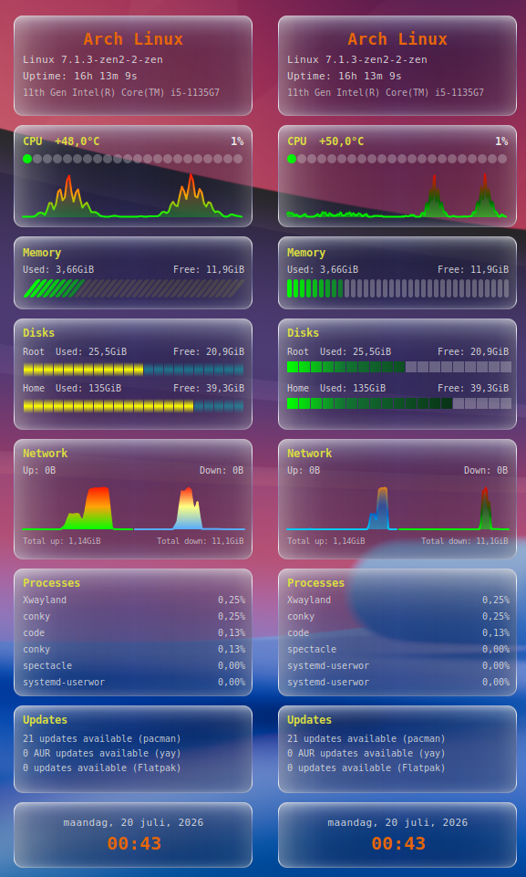

# conky-system-redone-v2

A liquid-glass Conky system monitor for Linux, rebuilt entirely in Lua + Cairo.



## About

`conky-system-redone-v2` is a full Lua/Cairo rebuild of the classic text-based
`conky-system.conf`. Instead of relying on Conky's built-in text and bar
rendering, every panel is hand-drawn on a Cairo surface with a soft, semi-
transparent "glass" style. `widget.lua` is the entry point Conky loads — it
draws the core info panels itself and pulls in a couple of small companion
scripts for the bars and graphs layers.

Built and tested on Arch Linux with KDE Plasma (Wayland), but there's nothing
Wayland- or KDE-specific in the widget itself — it should run anywhere Conky
runs with Lua/Cairo support.

## Features

The main panel shows:

- **System** — distro, kernel, uptime, CPU model
- **CPU** — load % and temperature (auto-prefers the CPU's own on-die sensor
  over a motherboard Super I/O "CPU" reading)
- **Memory** — used / free
- **Storage** — root partition, plus a separate "Home" row only if `/home` is
  actually its own filesystem (auto-detected)
- **Network** — up/down speed and totals for a configurable interface
- **Processes** — top 6 by CPU usage
- **Updates** — pacman/apt, and optionally AUR (yay/paru) and Flatpak update
  counts
- **Date & time**

Two extra modules layer on top of the main panel:

- **Bars** (`scripts/bars.lua` / `scripts/bars2.lua`) — CPU load, memory %,
  and filesystem usage as bars
- **Graphs** (`scripts/graphs.lua` / `scripts/graphs2.lua`) — CPU load and
  network up/down history as line graphs

Each comes in two visual styles — pick your favorite in `widget.lua`:

```lua
bars_module = "bars2",     -- "bars" or "bars2"
graphs_module = "graphs2", -- "graphs" or "graphs2"
```

## Requirements

- Conky, compiled with Lua + Cairo support (and either `cairo_xlib` on X11,
  or Wayland's native `conky_surface()` — the widget detects and uses
  whichever is available)
- A monospace font — `DejaVu Sans Mono` by default, configurable in
  `widget.lua`

Optional command-line tools, each only used if present (missing ones are
silently skipped):

| Tool | Used for |
| --- | --- |
| `lsb_release` | distro name |
| `pacman` / `checkupdates` (`pacman-contrib`) or `apt` | update counts |
| `yay` or `paru` | AUR update count |
| `flatpak` | Flatpak update count |

## Installation

1. Clone the repo:

   ```bash
   git clone https://github.com/wim66/conky-system-redone-v2.git
   cd conky-system-redone-v2
   ```

2. Open `widget.lua` and set `network_iface` to your own network interface
   (find it with `ip -o link show`), and adjust any other config values
   (colors, font, AUR helper, etc.) to taste — see [Configuration](#configuration)
   below for the full list.
3. Start it:

   ```bash
   conky -c conky.conf
   ```

   or use the included `autostart.sh`, which stops any already-running
   `conky` cleanly before relaunching — handy to add to your desktop
   environment's own autostart.

## Configuration

Everything is set in the `CFG` table near the top of `widget.lua` — no other
file needs editing for normal tweaks.

### General

| Key | Default | Description |
| --- | --- | --- |
| `network_iface` | `"enp0s31f6"` | Interface used for the Network panel. Find yours with `ip -o link show`. |
| `bars_module` | `"bars2"` | Which bars style to load from `scripts/`: `"bars"` or `"bars2"`. |
| `graphs_module` | `"graphs2"` | Which graphs style to load from `scripts/`: `"graphs"` or `"graphs2"`. |

### Updates

| Key | Default | Description |
| --- | --- | --- |
| `aur_helper` | `"yay"` | AUR helper for the extra Updates line. Set to `"paru"`, or `""` to disable AUR checking entirely. |
| `show_flatpak_updates` | `true` | Adds a Flatpak update count. Safe to leave on even without Flatpak — it's skipped automatically if the `flatpak` binary isn't found. Involves a `flatpak update --appstream` metadata refresh every 30 minutes. |

## File overview

```text
widget.lua           main widget: config, layout, and all info panels
scripts/bars.lua      bar-style CPU/mem/disk indicators — style 1
scripts/bars2.lua     bar-style CPU/mem/disk indicators — style 2
scripts/graphs.lua    CPU/network history graphs — style 1
scripts/graphs2.lua   CPU/network history graphs — style 2
conky.conf           Conky window/runtime settings, loads widget.lua
autostart.sh         (re)starts conky cleanly, for use with your DE's autostart
```
